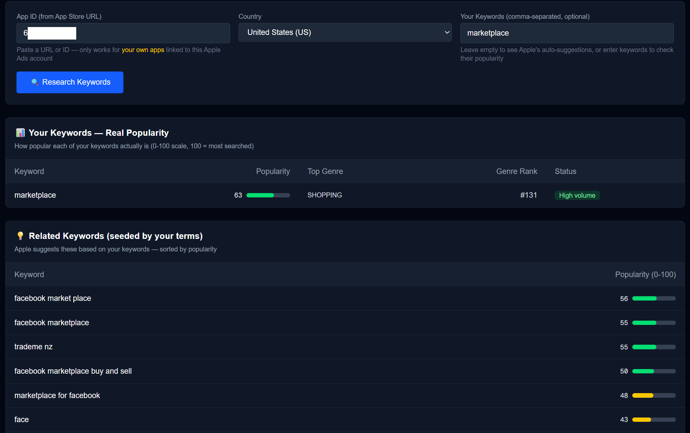
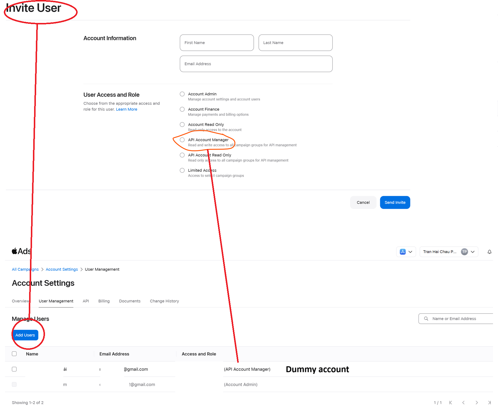
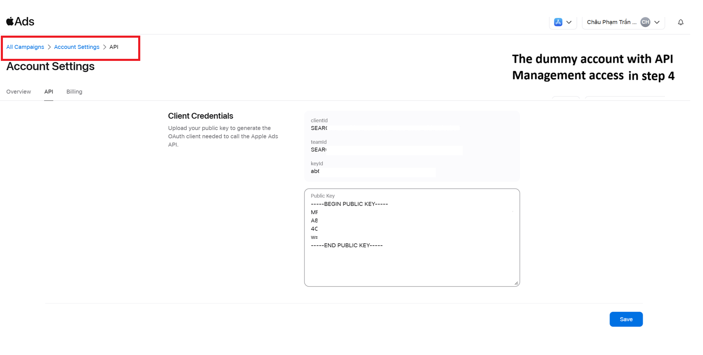
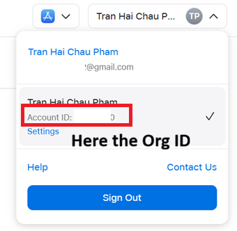

# 🍎 App Store ASO Keyword Volume — Real Mobile App Search Data

See **real keyword search volume** for the App Store — powered by Apple's official API (not third-party guesses).

The first open-source tool that uses Apple's official Ads Platform API to give mobile app developers **actual keyword popularity scores (0-100)** for ASO (App Store Optimization).

Enter your app ID → get keyword popularity scores on a 0-100 scale, discover related keywords, and see what Apple suggests you target.



---

## What You Need (Summary)

| What | Why | Time |
|------|-----|------|
| Apple Developer account with at least 1 published app | Apple Ads requires a linked App Store Connect account | You probably have this |
| Apple Ads Advanced account (free) | Gives you API access | 2 minutes |
| A second Apple Account (any free email) | Apple forces API users to be separate from admin — annoying but required | 2 minutes |
| Node.js installed on your computer | Runs the app locally | 5 minutes if you don't have it |
| This repo running locally | The app itself | 5 minutes |

**Total setup time: ~15 minutes** (one-time, then you never touch it again).

---

## Step-by-Step Setup Guide

### Step 1: Create an Apple Ads Advanced Account

If you already have one, skip this.

1. Go to [ads.apple.com](https://ads.apple.com)
2. Click **Sign In → Advanced**
3. Sign in with the Apple Account that owns your apps (the one linked to App Store Connect)
4. Complete the setup — accept terms, link your App Store Connect account
5. You do NOT need to create a campaign or add payment. Just finish the initial setup.

### Step 2: Create a Second Apple Account

Apple requires API users to have a different role than admin. You can't use your main account for both. Yes, this is annoying. But it takes 2 minutes.

1. Go to [account.apple.com](https://account.apple.com)
2. Create a new Apple Account with any email (Gmail works fine)
3. Verify the email

### Step 3: Register the New Account in Apple Ads

The new account must "exist" in Apple's ad system before you can invite it.

1. Open an **incognito/private browser** window
2. Go to [ads.apple.com](https://ads.apple.com) → Sign In → Advanced
3. Sign in with your **new** Apple Account (from Step 2)
4. Complete whatever setup it asks (accept terms, etc.)
5. Once you see a dashboard (even if empty), you're done. Close this window.

### Step 4: Invite the New Account as API User

1. Back in your **main browser** (signed in as your original admin account)
2. Go to **Account Settings → User Management**
3. Click **"Add Users"**
4. Enter the new account's email, select role **"API Account Manager"**, click Send Invite



5. Go to the new account's email inbox, accept the invite (click link, enter code)

### Step 5: Generate API Keys

You need to create a pair of security files on your computer. One stays private (on your machine), one gets uploaded to Apple.

**On Mac/Linux — open Terminal app and run:**

```bash
openssl genpkey -algorithm EC -pkeyopt ec_paramgen_curve:prime256v1 -out private-key.pem
openssl pkey -in private-key.pem -pubout -out public-key.pem
```

**On Windows — open Git Bash (installed with Git) and run:**

```bash
openssl genpkey -algorithm EC -pkeyopt ec_paramgen_curve:prime256v1 -out private-key.pem
openssl pkey -in private-key.pem -pubout -out public-key.pem
```

> **Don't have Git/OpenSSL?** Install Git from [git-scm.com](https://git-scm.com/downloads). It includes OpenSSL. After installing, open "Git Bash" from your Start menu.

After running these commands, you'll have two files wherever your terminal was pointed:
- `private-key.pem` — **keep this secret, never share it**
- `public-key.pem` — this one gets uploaded to Apple in the next step

**Move both files** into the project folder later (Step 9 explains where).

### Step 6: Upload Public Key to Apple Ads

1. Sign in to [ads.apple.com](https://ads.apple.com) as the **new API user** (the one you invited in Step 4 — NOT your admin account)
2. Go to **Account Settings → API**
3. You'll see a "Client Credentials" section with a **Public Key** text field
4. Open `public-key.pem` in any text editor (Notepad, TextEdit, etc.), copy EVERYTHING including the `-----BEGIN PUBLIC KEY-----` and `-----END PUBLIC KEY-----` lines
5. Paste it into the Public Key field
6. Click **Save**



After saving, three values appear above the key field. **Copy all three** — you need them next:
- `clientId` — looks like `SEARCHADS.xxxxxxxx-xxxx-xxxx-xxxx-xxxxxxxxxxxx`
- `teamId` — looks like `SEARCHADS.xxxxxxxx-xxxx-xxxx-xxxx-xxxxxxxxxxxx`
- `keyId` — looks like `xxxxxxxx-xxxx-xxxx-xxxx-xxxxxxxxxxxx`

### Step 7: Download This Project and Configure It

**If you've never used a code project before:**

1. Install **Node.js** from [nodejs.org](https://nodejs.org) (download the LTS version, click through the installer)
2. Download this repo: click the green **"Code"** button on GitHub → **"Download ZIP"** → extract it to a folder on your computer (e.g. your Desktop)
3. Open that folder in a code editor (like [VS Code](https://code.visualstudio.com/) — free) or just use a terminal

**Open a terminal inside the project folder:**
- **VS Code**: Open the folder → press `` Ctrl+` `` (backtick) to open the built-in terminal
- **Windows**: Open the folder in File Explorer → type `cmd` in the address bar → press Enter
- **Mac**: Open Terminal → type `cd ` then drag the folder into the Terminal window → press Enter

**Now run these commands one at a time in that terminal:**

```bash
npm install
```

This downloads all the project dependencies (takes ~30 seconds).

**Next, create your configuration file:**

- Find the file called `.env.local.example` in the project folder
- Make a copy of it and rename the copy to `.env.local` (remove the `.example` part)
- Open `.env.local` in a text editor and replace the placeholder values with your real values from Step 6:

```env
APPLE_ADS_CLIENT_ID=SEARCHADS.xxxxxxxx-xxxx-xxxx-xxxx-xxxxxxxxxxxx
APPLE_ADS_TEAM_ID=SEARCHADS.xxxxxxxx-xxxx-xxxx-xxxx-xxxxxxxxxxxx
APPLE_ADS_KEY_ID=xxxxxxxx-xxxx-xxxx-xxxx-xxxxxxxxxxxx
APPLE_ADS_PRIVATE_KEY=
```

Leave `APPLE_ADS_PRIVATE_KEY` empty.

**Finally, move your key file:**

Move the `private-key.pem` file (from Step 5) into this project folder — the same folder where `package.json` is. The app will find it automatically.

### Step 8: Find Your Org ID

1. Sign in to [ads.apple.com](https://ads.apple.com) with **either** of your accounts
2. Click your **name/avatar** in the top-right corner
3. You'll see your account listed with an **"Account ID"** number (e.g. `19943210`)
4. That's your Org ID — remember it for when you use the app



### Step 9: Run the App

In the same terminal from Step 7 (inside the project folder), run:

```bash
npm run dev
```

You'll see output like this:

```
▲ Next.js 16.x.x
- Local: http://localhost:3000
```

**Open your browser** and go to the URL shown in the terminal (usually `http://localhost:3000`, but if that port is busy it might say `http://localhost:3001` or another number — **use whatever URL your terminal shows**).

That's it! The app is running. Enter your Org ID and your app's Adam ID to start.

> **To stop the app:** press `Ctrl+C` in the terminal.
> **To start it again later:** open a terminal in the project folder and run `npm run dev` again.

---

## Finding Your App's Adam ID

Your App ID (Adam ID) is the number in your App Store URL:

```
https://apps.apple.com/us/app/your-app-name/id1234567890
                                               ^^^^^^^^^^
                                               This is your Adam ID
```

You can also find it in App Store Connect → App Information → Apple ID.

You can paste the full URL into the app — it auto-extracts the number.

---

## How to Use

1. Enter your **Org ID** (from Step 8)
2. Enter your **App ID** (or paste the full App Store URL)
3. Optionally enter keywords you want to check (comma-separated)
4. Click **Research Keywords**

### Results Explained

| Section | What it shows |
|---------|---------------|
| **Your Keywords — Real Popularity** | How popular each keyword you entered actually is (0-100). Keywords below Apple's threshold show "no data" — means they're very niche. |
| **Related Keywords (seeded)** | Apple's suggestions based on the keywords you entered — these are adjacent terms people search |
| **Apple's Auto-Suggestions** | High-volume terms Apple thinks are relevant to your app |

### Popularity Score

| Score | What it means |
|-------|---------------|
| 70-100 | Extremely popular, very competitive |
| 50-69 | Popular, competitive |
| 30-49 | Medium volume, good opportunity zone |
| 15-29 | Lower volume, less competition |
| 1-14 | Very niche |
| No data | Too niche for Apple to report |

---

## Limitations

- **App-specific suggestions only work for YOUR apps** — apps must be linked to your Apple Ads account. You cannot look up competitors' apps.
- **Very niche keywords may show no data** — Apple only reports terms above a certain popularity threshold.
- **The popularity score is relative**, not an absolute search count. 100 = most searched term overall, 1 = barely searched.

---

## Tech Stack

- Next.js 16 (App Router, TypeScript)
- Tailwind CSS
- jose (JWT signing)
- Apple Ads Platform API v1

## API Docs

- [Apple Ads Platform API](https://developer.apple.com/documentation/apple-ads-platform-api)
- [OAuth Setup](https://developer.apple.com/documentation/apple-ads-platform-api/implementing-oauth-for-the-apple-ads-platform-api)
- [Insights Endpoints](https://developer.apple.com/documentation/apple-ads-platform-api/insights-endpoints)
- [Suggestions Endpoints](https://developer.apple.com/documentation/apple-ads-platform-api/suggestions-endpoints)

## License

MIT
